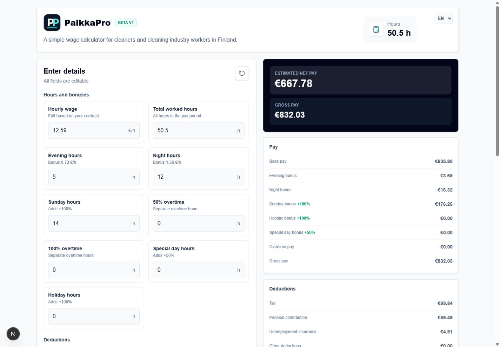
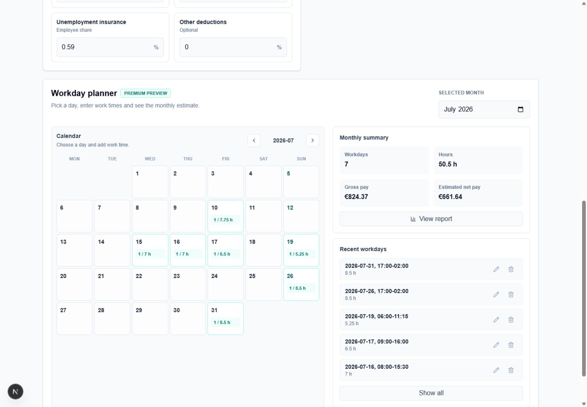
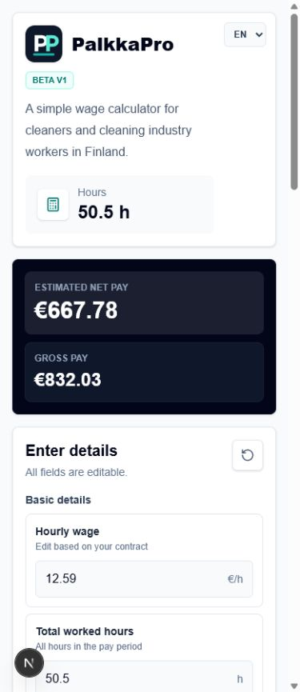

<div align="center">

# PalkkaPro

**A modern Finnish salary calculator for cleaners and cleaning industry workers.**

[](https://palkkapro.com)
[](https://nextjs.org/)
[](https://react.dev/)
[](https://www.typescriptlang.org/)
[](https://tailwindcss.com/)
[](https://vercel.com/)

</div>

## Overview

**PalkkaPro** helps cleaners and cleaning industry workers in Finland estimate salary from hourly wage, worked hours, shift bonuses, deductions, and taxes.

The app is focused on cleaning-sector work patterns in Finland and supports common estimated additions such as evening, night, Sunday, holiday, and overtime compensation. All calculations are clearly presented as estimates.

**Live website:** [https://palkkapro.com](https://palkkapro.com)

## Table of Contents

- [Screenshots](#screenshots)
- [Features](#features)
- [Tech Stack](#tech-stack)
- [Getting Started](#getting-started)
- [Available Scripts](#available-scripts)
- [Roadmap](#roadmap)
- [Contributing](#contributing)
- [License](#license)
- [Contact](#contact)
- [Disclaimer](#disclaimer)

## Screenshots

| Calculator | Calendar |
| --- | --- |
|  |  |

| Mobile |
| --- |
|  |

## Features

- Finnish cleaning industry salary calculator
- Gross salary estimation
- Net salary estimation
- Evening bonus calculation
- Night bonus calculation
- Sunday bonus calculation
- Holiday and special day support
- Overtime support
- Editable deduction percentages
- Multilingual UI: Finnish, English, and Estonian
- Mobile responsive layout
- Modern SaaS-style interface

## Tech Stack

| Category | Technology |
| --- | --- |
| Framework | [Next.js](https://nextjs.org/) |
| UI | [React](https://react.dev/) |
| Language | [TypeScript](https://www.typescriptlang.org/) |
| Styling | [Tailwind CSS](https://tailwindcss.com/) |
| Icons | [Lucide React](https://lucide.dev/) |
| Hosting | [Vercel](https://vercel.com/) |

## Getting Started

### Prerequisites

- Node.js 20 or newer recommended
- npm

### Installation

Clone the repository:

```bash
git clone https://github.com/your-username/palkkapro.git
cd palkkapro
```

Install dependencies:

```bash
npm install
```

Start the development server:

```bash
npm run dev
```

Open the app:

```text
http://localhost:3000
```

## Available Scripts

```bash
npm run dev
```

Runs the app locally in development mode.

```bash
npm run lint
```

Runs ESLint checks.

```bash
npm run build
```

Creates a production build.

```bash
npm run start
```

Starts the production server.

## Roadmap

- Schedule planner
- Automatic shift calculations
- AI schedule import
- Payslip comparison
- User accounts
- Support for more Finnish collective agreement scenarios

## Contributing

Contributions, ideas, and feedback are welcome.

To contribute:

1. Fork the repository
2. Create a new branch
3. Make your changes
4. Run linting and build checks
5. Open a pull request

For larger features, please open an issue first to discuss the direction.

## License

This project is currently private/proprietary unless a license is added later.

## Contact

- Website: [https://palkkapro.com](https://palkkapro.com)
- Project: **PalkkaPro**

For feedback, feature requests, or collaboration ideas, please use the feedback option on the live website.

## Disclaimer

PalkkaPro provides salary estimates only. Final pay can depend on the employee's tax card, age, employment contract, applicable collective agreement, employer payroll rules, and other possible deductions.
